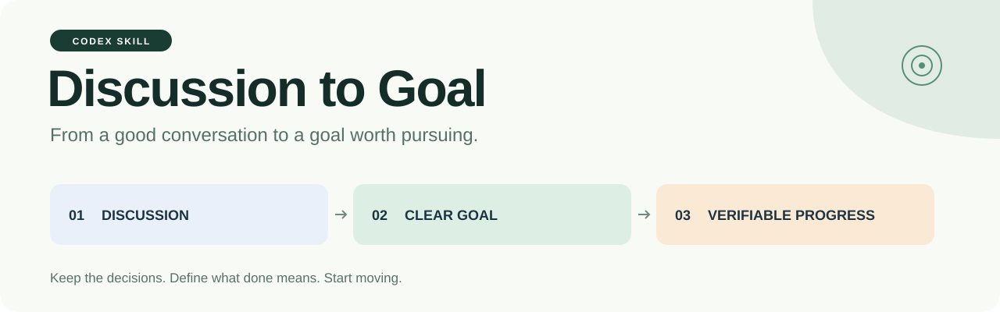
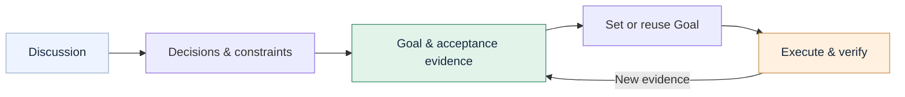

<p align="center">
  
</p>

<p align="center">
  <strong>English</strong> · <a href="README.zh-CN.md">简体中文</a>
</p>

<p align="center">
  A Codex skill for the moment a good discussion is ready to become real work.<br>
  <strong>Keep the decisions. Define what done means. Start moving.</strong>
</p>

<p align="center">
  <a href="#2-get-started">Get started</a> ·
  <a href="#3-see-it-in-action">See an example</a> ·
  <a href="SKILL.md">Read the skill</a> ·
  <a href="https://github.com/thejaytang/discussion-to-goal/releases/latest">Download</a>
</p>

## 1. Give your discussion a next step

You have explored the problem, weighed options, and agreed on a direction. **Discussion to Goal** carries those decisions into an actionable objective, checks how success will be demonstrated, and starts the authorized work.

```text
$discussion-to-goal Turn our discussion into a goal and start working on it.
```



**What it adds to your workflow**

- **Decision continuity.** Keeps confirmed choices, temporary decisions, suggestions, and open questions distinct.
- **Useful expert perspectives.** Reviews intent, feasibility, acceptance evidence, and delivery risks. Each perspective must change the plan in a concrete way.
- **Traceable completion.** Connects each important requirement to an action and the evidence needed to show it is satisfied.
- **Goal handoff.** Checks the current Goal, creates or reuses one when appropriate, verifies the result, and begins a substantive first action.
- **Adaptive progress.** Updates the approach when evidence changes, preserves recovery context, and identifies work that is merely repeating itself.

## 2. Get started

### 2.1 Install with Codex

Ask Codex:

```text
Use skill-installer to install the skill from
https://github.com/thejaytang/discussion-to-goal
The skill is at the repository root. Install it as discussion-to-goal.
```

The package is a standard `SKILL.md` directory. The installer should use your configured skill location and preserve an existing installation. See the [official skills documentation](https://developers.openai.com/codex/skills/) for your environment's skill support.

<details>
<summary>Manual installation for environments using CODEX_HOME/skills</summary>

With Git installed, run in a POSIX shell:

```bash
mkdir -p "${CODEX_HOME:-$HOME/.codex}/skills"
git clone https://github.com/thejaytang/discussion-to-goal.git \
  "${CODEX_HOME:-$HOME/.codex}/skills/discussion-to-goal"
```

If that directory already exists, inspect it before updating; this command does not replace a non-empty installation. If your host uses a different skill discovery directory, choose that directory instead. Refresh skill discovery or start a new conversation if the skill is not listed.

</details>

### 2.2 Use it after a discussion

| Your intent | Say this |
|---|---|
| Plan, set the Goal, and start | `$discussion-to-goal Turn our discussion into a goal and start working on it.` |
| Review the prompt first | `$discussion-to-goal Draft the goal prompt only. Do not execute yet.` |
| Preserve an execution boundary | `$discussion-to-goal Plan and implement the agreed changes locally. Do not publish.` |

**Direct invocation starts the full workflow unless you explicitly request a draft.** Existing permissions remain in force. Publishing, sending material, spending money, and other additional actions still require the relevant authorization.

## 3. See it in action

*Illustrative example, not a benchmark or a recording of a completed run.*

**The discussion**

> Drafts sometimes disappear after an interruption. We have a failing sample. Fix recovery, preserve original files and archived versions, and show that reopening restores the saved work.

**The goal it should produce**

> Restore draft recovery after interruption. Begin by locating the failing sample and reproducing the loss in an isolated copy. Preserve original files and archived versions. Implement a repair, then verify interruption, reopening, and content preservation with the affected workflow. Treat a saved-file message as insufficient evidence until the draft can actually be reopened. Report the result and any remaining gaps.

**The handoff**

```text
Read the current Goal
  → Create or reuse the appropriate Goal
  → Read back and confirm the objective
  → Locate the failing sample and start the investigation
```

For a research task, the evidence might be source alignment and a revised manuscript. For a report, it might be reconciled figures and an inspectable final document. The workflow follows the domain.

## 4. How the review works

| Perspective | The question that improves the goal |
|---|---|
| Requirements lead | Does this outcome solve the user's actual problem? |
| Domain specialist | Which assumptions, methods, or dependencies need verification? |
| Acceptance reviewer | What observation would prove the result, or show it has failed? |
| Delivery lead | What is the next useful action, and what changes if it fails? |

For the most consequential assumption, a skeptical pass adds a concrete counterexample or failure check. These are reasoning perspectives within the workflow; installing the skill does not automatically launch a team of agents.

The overall goal, current stage, and next checkpoint remain separate. A functioning interface, an unmeasured quality target, and a pending real-device check retain their own status.

## 5. Compatibility and current validation

| Environment | Behavior |
|---|---|
| A Codex environment exposing `get_goal`, `create_goal`, and `update_goal` | Uses the available Goal lifecycle, following the host's current tool definitions. |
| Goal tools unavailable | Produces the prompt, states that no Goal was set, and continues authorized ordinary work. |
| A different unfinished Goal already exists | Reports the conflict, preserves the proposed objective, and continues independent authorized preparation. It does not clear or overwrite the old Goal. |

This is an instruction-based skill. It does not add Goal tools, run a background service, or guarantee unattended execution. No API key or additional runtime package is required by the skill itself; the work you ask it to perform may have its own requirements.

The source skill received a six-scenario simulated behavior review. The public package also receives structural and packaging checks. **Live Goal integration across installations has not yet been validated.** The instructions are currently written in Chinese; they direct the agent to respond in the language of your conversation. English and Chinese READMEs cover the same workflow.

See the [validation record](project-support/validation.md) for the scope of the checks.

## 6. Design notes and contributions

The workflow draws on ideas from [Superpowers](https://github.com/obra/superpowers), [GSD](https://github.com/gsd-build/get-shit-done), [GitHub Spec Kit](https://github.com/github/spec-kit), and [OpenSpec](https://github.com/Fission-AI/OpenSpec). These projects are references, not dependencies or affiliations. The [design rationale](references/design-rationale.md) explains what was adapted and why.

Have a case where a decision was lost, a Goal stalled, or completion was claimed too early? [Open an issue](https://github.com/thejaytang/discussion-to-goal/issues) with a small, anonymized example, expected behavior, observed behavior, and the tools your environment exposed. Remove credentials and private conversation content before sharing.

Maintainers: start with [AGENTS.md](AGENTS.md) and [PROJECT_STATE.md](PROJECT_STATE.md).

## 7. License

[MIT](LICENSE) © 2026 Jay Tang.
