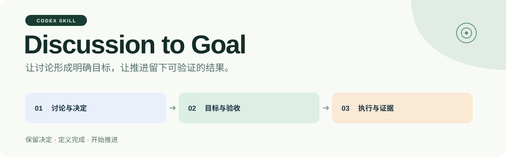
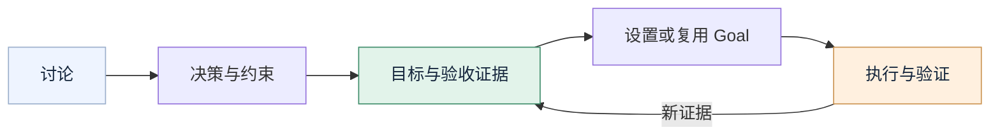

<p align="center">
  
</p>

<p align="center">
  <a href="README.md">English</a> · <strong>简体中文</strong>
</p>

<p align="center">
  一个 Codex Skill，把已经讨论清楚的方向带入实际工作。<br>
  <strong>保留决定，定义完成，开始推进。</strong>
</p>

<p align="center">
  <a href="#2-开始使用">开始使用</a> ·
  <a href="#3-看一个例子">使用示例</a> ·
  <a href="SKILL.md">查看 Skill</a> ·
  <a href="https://github.com/thejaytang/discussion-to-goal/releases/latest">下载</a>
</p>

## 1. 让讨论有一个明确的下一步

问题已经聊过，方案比较过，方向也达成了一致。**Discussion to Goal** 会把这些决定转成可执行目标，检查如何证明完成，然后开始已授权的工作。

```text
$discussion-to-goal 把刚才的讨论整理成目标，并开始推进。
```



**它为工作流程补上什么**

- **保留讨论中的决定。** 区分已确认选择、临时决策、尚未接受的建议和待解决问题。
- **用专业视角改善目标。** 检查需求、可行性、验收证据和交付风险，每个视角都要落实为具体改进。
- **让完成可追溯。** 将重要需求与行动、证明其满足的证据对应起来。
- **接上 Goal 执行。** 检查当前目标，适当创建或复用，确认设置结果，再开始第一项实质行动。
- **根据证据调整。** 修正推进路径，保留恢复上下文，识别只在重复而没有进展的工作。

## 2. 开始使用

### 2.1 通过 Codex 安装

对 Codex 说：

```text
使用 skill-installer 从以下仓库安装 Skill：
https://github.com/thejaytang/discussion-to-goal
Skill 位于仓库根目录，请安装为 discussion-to-goal。
```

这是标准的 `SKILL.md` 目录包。安装器应使用当前环境配置的 Skill 位置，并保留已有安装。各环境的支持方式可查阅 [官方 Skills 文档](https://developers.openai.com/codex/skills/)。

<details>
<summary>使用 CODEX_HOME/skills 的环境：手动安装</summary>

已安装 Git 时，在 POSIX shell 中运行：

```bash
mkdir -p "${CODEX_HOME:-$HOME/.codex}/skills"
git clone https://github.com/thejaytang/discussion-to-goal.git \
  "${CODEX_HOME:-$HOME/.codex}/skills/discussion-to-goal"
```

如果目录已经存在，先检查后更新；这个命令不会替换已有的非空目录。如果宿主使用其他 Skill 发现目录，请改用对应位置。未看到 Skill 时，刷新 Skill 列表或开始新会话。

</details>

### 2.2 讨论后调用

| 你的意图 | 这样说 |
|---|---|
| 整理计划、设置目标并开始 | `$discussion-to-goal 把刚才的讨论整理成目标，并开始推进。` |
| 先看提示词 | `$discussion-to-goal 只生成目标提示词，暂不执行。` |
| 保留执行边界 | `$discussion-to-goal 规划并在本地实施已讨论的改动，不要发布。` |

**直接调用默认进入完整流程；明确要求草稿时只生成草稿。** 既有权限边界继续有效，发布、外发、付费等额外操作仍需要相应授权。

## 3. 看一个例子

*以下是说明性示例，不是性能测试或真实完成记录。*

**讨论内容**

> 中断后草稿有时会丢失。我们已经有一个失败样本。修复恢复流程，保留原文件和已归档版本，并验证重新打开后能恢复保存的内容。

**应该形成的目标**

> 修复中断后的草稿恢复。先定位已有失败样本，在隔离副本中复现丢失问题。保留原文件与已归档版本。实施修复后，沿实际使用流程验证中断、重新打开及内容保留。只有“已保存”消息还不够，必须能够重新打开草稿。汇报结果与尚未解决的缺口。

**接下来实际推进**

```text
读取当前 Goal
  → 创建或复用适当的 Goal
  → 回读并确认目标内容
  → 定位失败样本，开始调查
```

换成研究任务，证据可以是主张与来源的对应关系、修订后的稿件；换成报告任务，证据可以是核对后的数字和可检查的最终文档。流程随任务领域调整。

## 4. 专业审查如何发挥作用

| 视角 | 用来改善目标的问题 |
|---|---|
| 需求负责人 | 这个结果是否解决了用户真正的问题？ |
| 领域专家 | 哪些假设、方法或依赖需要验证？ |
| 验收负责人 | 什么观察能证明结果成立，或说明它失败？ |
| 交付负责人 | 下一项有用的行动是什么，失败后怎样调整？ |

对最影响结果的假设，再从反方视角提出具体反例或失败检查。这些是工作流内的分析视角，安装 Skill 不会自动启动多个 Agent。

总目标、当前阶段和下一检查点分别表达。界面功能已通过、质量尚未测量、真实设备仍待验证，各自保留状态。

## 5. 兼容性与当前验证情况

| 环境 | 行为 |
|---|---|
| 提供 `get_goal`、`create_goal`、`update_goal` 的 Codex 环境 | 根据宿主当前工具定义使用 Goal 功能。 |
| Goal 工具不可用 | 生成提示词，明确尚未设置 Goal，并继续已经授权的普通执行。 |
| 已有另一个未完成的 Goal | 说明冲突，保留拟定的新目标，继续不依赖切换的已授权准备，不清空或覆盖旧目标。 |

这是基于指令的 Skill。它不会增加 Goal 工具、运行后台服务或保证无人值守执行。Skill 本身不需要 API key 或额外运行依赖；你交给它的实际工作可能有自身的依赖要求。

源 Skill 已完成六个情境的模拟行为审查，公开包另做结构与打包检查。**不同安装环境中的真实 Goal 集成尚未完成验证。** 当前 Skill 指令正文使用中文，并要求 Agent 按当前对话语言输出；中英文 README 介绍同一套流程。

具体检查范围见 [验证记录](project-support/validation.md)。

## 6. 设计依据与参与改进

设计参考了 [Superpowers](https://github.com/obra/superpowers)、[GSD](https://github.com/gsd-build/get-shit-done)、[GitHub Spec Kit](https://github.com/github/spec-kit) 和 [OpenSpec](https://github.com/Fission-AI/OpenSpec)。它们是思路来源，不是依赖或关联项目。[设计说明](references/design-rationale.md) 记录了吸收的机制与取舍。

遇到决定被遗漏、目标停滞或过早宣布完成？欢迎 [提交 Issue](https://github.com/thejaytang/discussion-to-goal/issues)，提供一段简短、匿名化的例子，说明预期行为、实际行为和环境提供的工具。分享前请移除凭证和私人对话内容。

维护者请从 [AGENTS.md](AGENTS.md) 与 [PROJECT_STATE.md](PROJECT_STATE.md) 开始。

## 7. 许可

[MIT](LICENSE) © 2026 Jay Tang。
